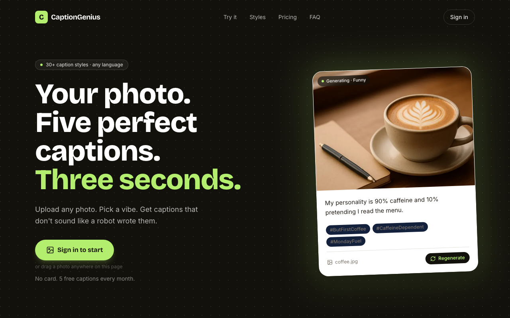
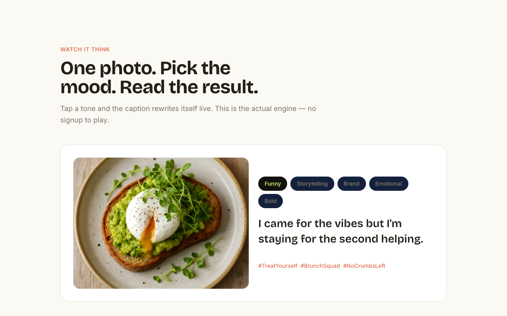
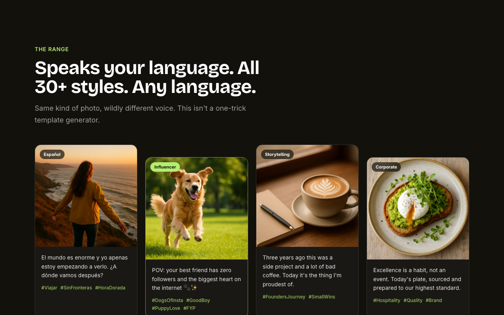
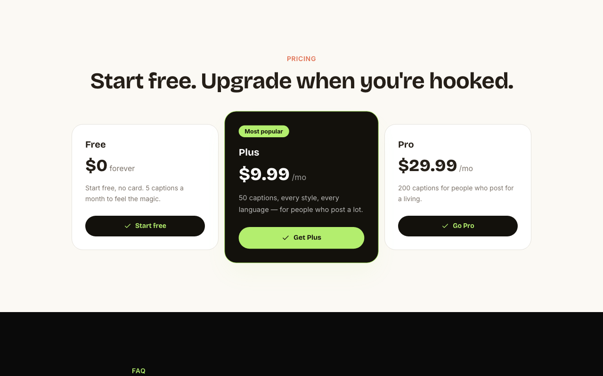
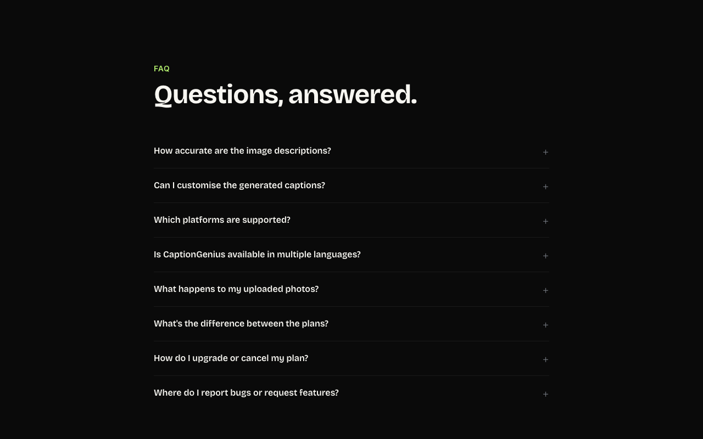
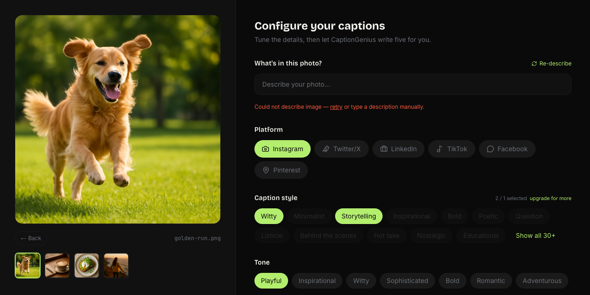
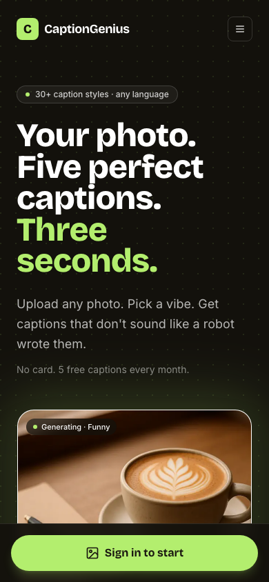

# CaptionGenius

> **Your photo. Five perfect captions. Three seconds.**

CaptionGenius turns any uploaded photo into five ready-to-post social media captions — tailored by platform, tone, style, and language. Powered entirely by Groq's free AI APIs. No writing block. No generic output.

---

## Screenshots

### Landing page — Hero


Live-cycling demo card auto-types captions in different tones. No signup required to see the engine work.

### Interactive tone explorer


Tap any tone pill and the caption rewrites itself instantly. The actual Groq model, running live.

### Style showcase


### Pricing


### FAQ


### Caption Studio


Dark two-panel interface. Photo left, configuration right. Groq vision auto-describes the image on arrival.

### Mobile


---

## How It Works

```
User uploads photo(s)  →  stored in Cloudflare R2
        ↓
Groq Llama 4 Scout vision describes each image  (cached in Neon DB — one call ever)
  "A golden retriever mid-run across a sunlit park"
        ↓
User picks: platform · style(s) · tone · length · language · hashtags on/off
        ↓
Groq Llama 3.3 70B generates 5 captions per image as JSON
        ↓
Edit inline · Copy · Bookmark to Favourites · Share · Regenerate
```

**Why split vision and caption generation?**
The vision call happens once per image and is cached forever in Postgres. Switching tone from Playful to Sophisticated costs nothing — the description is already there and new captions generate in ~2 seconds.

---

## Features

### Caption Studio

**Batch generation (v2)**
- Upload multiple photos → Generate captions for all in one click
- Tabbed output — click each photo tab to view its 5 captions
- One monthly credit per batch, not per photo

**Inline editing (v2)**
- Hover any caption → pencil icon appears
- Click to open an auto-resizing textarea
- ⌘↵ to save · Esc to cancel · saved captions show an "edited" badge
- Copy and Copy All use the edited text

**Social share (v3)**
- Share icon per caption → Web Share API on mobile (native sheet), clipboard fallback on desktop
- "Share" button in the action row shares all 5 captions at once

**Favourites (v2)**
- Bookmark any caption — persisted in DB, survives sessions
- Click again to unbookmark (DB record deleted)
- `/favourites` page: full list with platform, tone, hashtag context + delete

### Configuration

| Option | Choices |
|---|---|
| **Platform** | Instagram, Twitter/X, LinkedIn, TikTok, Facebook, Pinterest |
| **Caption style** | 32 styles — Witty, Storytelling, Bold, Nostalgic, Sarcastic, Luxury, Cinematic, Pun... |
| **Tone** | Playful, Inspirational, Witty, Sophisticated, Bold, Romantic, Adventurous |
| **Length** | Snappy (< 15 words), Standard (20–40 words), Extended (60–100 words) |
| **Language** | Any — type the language name |
| **Hashtags** | Toggle on/off — 5–8 tags per caption |

Style selection is plan-gated: Free = 1, Plus = 3, Pro = 5.

### Dashboard (`/dashboard`)
- Monthly usage bar (lime → amber → coral)
- Last 6 generation cards with copy-all
- Manage billing → Stripe customer portal for paid users

### History + Favourites
- `/history` — last 20 generations with full captions, per-caption copy
- `/favourites` — all bookmarked captions with delete

### Admin (`/admin`)
- Overview: users, generations, plan breakdown
- Users table: search + inline role management

### Admin Health Dashboard (`/admin/health`) — v3
- Real-time metric cards: Total Users, R2 Storage, Groq Calls Today, DB Row Count
- Status badges: `ok` (lime) · `warning` at 85% (amber) · `exceeded` at 100% (red)
- Progress bar per metric
- Kill switch: one click pauses all uploads and generation app-wide
- Auto-pauses when any metric is exceeded, with email notification

---

## Pricing

| Plan | Monthly generations | Price |
|---|---|---|
| **Free** | 5 | $0 — no card |
| **Plus** | 50 | $9.99 / month |
| **Pro** | 200 | $29.99 / month |

- Counter resets automatically on the 1st of each calendar month
- All plans: all platforms, tones, languages, hashtag support
- Stripe billing fully integrated — checkout, webhooks, customer portal

---

## Tech Stack

| Layer | What |
|---|---|
| **Framework** | Next.js 14 App Router |
| **Styling** | Tailwind CSS v3 — custom `lime` / `ink` / `coral` tokens |
| **AI — vision** | Groq `meta-llama/llama-4-scout-17b-16e-instruct` |
| **AI — captions** | Groq `llama-3.3-70b-versatile` → `llama-3.1-70b-versatile` → `llama-3.1-8b-instant` |
| **Database** | Neon serverless Postgres + Drizzle ORM |
| **File storage** | Cloudinary (free tier — 25GB storage, 25GB bandwidth/month) |
| **Auth** | NextAuth v4, Google OAuth, JWT sessions |
| **Payments** | Stripe Checkout + webhooks + customer portal |
| **Email alerts** | Resend (3,000 emails/month free) |
| **Animations** | Framer Motion |
| **HEIC support** | Browser Canvas API — native decoder, no WASM |

---

## API Routes

| Route | Method | Description |
|---|---|---|
| `/api/upload-image` | POST | Validates + uploads to Cloudinary, returns `folderId` |
| `/api/image` | GET | Lists filenames + Cloudinary URLs for a folder |
| `/api/describe-image` | POST | Cache-first Groq vision call |
| `/api/generate-caption` | POST | Auth + quota + kill-switch checked; batch-capable |
| `/api/user/usage` | GET | `{ used, limit, remaining, role }` |
| `/api/favourites` | GET/POST | Fetch all / save a favourite |
| `/api/favourites/[id]` | DELETE | Remove a favourite (ownership-checked) |
| `/api/checkout` | POST | Stripe Checkout session |
| `/api/webhooks/stripe` | POST | Subscription lifecycle |
| `/api/billing/portal` | POST | Stripe customer portal |
| `/api/cron/cleanup` | GET | 3am UTC — delete Cloudinary folders older than 24h |
| `/api/cron/health` | GET | 8am UTC — collect metrics, send alert if approaching/exceeded |
| `/api/admin/kill-switch/approve` | GET | Email link handler — resume or keep paused |
| `/api/admin/kill-switch/toggle` | POST | Admin dashboard manual toggle |
| `/api/admin/stats` | GET | Admin-only aggregate stats |
| `/api/admin/users/[id]` | PATCH | Admin role change |

---

## Database Schema

```
User              id, email, role, captionsUsed, resetDate, stripeCustomerId, stripeSubscriptionId
Generation        id, userId, folderId, imageCount, captions (JSON), formData (JSON), createdAt
ImageDescription  (folderId + filename) PK, description, model, createdAt   ← vision cache
Favourite         id, userId, captionText, hashtags, platform, tone, imageDesc, createdAt
SystemMetric      id, metricType, value, threshold, status, recordedAt       ← daily snapshots
KillSwitch        id (singleton), isActive, reason, activatedAt, approvedAt
Account/Session/VerificationToken — NextAuth tables
```

---

## Cost Alert System

Daily cron at 8am UTC (`/api/cron/health`) checks 4 metrics:

| Metric | Default threshold | What it measures |
|---|---|---|
| Total Users | 8,000 | Neon free tier row pressure |
| Cloudinary Storage | 8,000 MB | Cloudinary free = 25GB |
| Groq calls/day | 12,000 | Groq free = 14,400/day |
| DB Row Count | 800,000 | Neon free ≈ 1M rows |

- **≥ 85%** → warning email sent, app keeps running
- **≥ 100%** → exceeded email + app auto-pauses (kill switch activates)
- Email has **Resume Operations** / **Keep Paused** links — one click from inbox
- Admin can also manually toggle from `/admin/health`

Change thresholds via `ALERT_THRESHOLD_*` env vars — no code change needed.

---

## Local Setup

```bash
# 1. Install
npm install

# 2. Copy env and fill in values
cp .env.example .env
```

**Required env vars:**
```env
GROQ_API_KEY=          # console.groq.com — free, no card
NEXTAUTH_SECRET=       # openssl rand -base64 32
NEXTAUTH_URL=http://localhost:3000
GOOGLE_CLIENT_ID=      # console.cloud.google.com → OAuth 2.0
GOOGLE_CLIENT_SECRET=
DATABASE_URL=postgresql://...  # neon.tech — free serverless Postgres
```

**Storage (Cloudinary):**
```env
CLOUDINARY_CLOUD_NAME=   # cloudinary.com → Dashboard
CLOUDINARY_API_KEY=      # cloudinary.com → Dashboard
CLOUDINARY_API_SECRET=   # cloudinary.com → Dashboard
```

**Alert system:**
```env
RESEND_API_KEY=          # resend.com — free 3,000 emails/month
ADMIN_ALERT_EMAIL=       # your email
CRON_SECRET=             # openssl rand -base64 32
KILL_SWITCH_SECRET=      # openssl rand -base64 32
```

**Optional (Stripe billing):**
```env
STRIPE_SECRET_KEY=
STRIPE_WEBHOOK_SECRET=
NEXT_PUBLIC_STRIPE_PUBLISHABLE_KEY=
STRIPE_PLUS_PRICE_ID=
STRIPE_PRO_PRICE_ID=
```

```bash
# 3. Create Postgres tables
npm run db:push

# 4. Run
npm run dev   # → http://localhost:3000
```

**Test the health cron locally:**
```bash
curl -H "Authorization: Bearer $CRON_SECRET" \
  http://localhost:3000/api/cron/health
```

**DB helpers:**
```bash
npm run db:push     # sync schema (safe, non-destructive)
npm run db:studio   # visual DB browser
```

---

## Project Structure

```
src/
├── app/
│   ├── page.tsx                    # Landing (Hero, Explorer, Styles, Pricing, FAQ)
│   ├── generate-caption/[id]/      # Caption studio
│   ├── dashboard/                  # User dashboard
│   ├── history/                    # Generation history
│   ├── favourites/                 # Bookmarked captions
│   ├── admin/                      # Admin overview + users + health
│   ├── studio/                     # Demo page (sample photos)
│   └── api/                        # All API routes
├── components/
│   ├── landing/                    # Hero, CaptionExplorer, RangeShowcase, Pricing, FAQ
│   ├── studio/                     # CaptionStudio, ConfigForm, CaptionResultCard
│   ├── dashboard/                  # DashboardClient
│   ├── admin/                      # AdminUsersClient, AdminHealthClient
│   ├── history/                    # CopyButton
│   └── favourites/                 # DeleteFavButton
├── db/
│   ├── index.ts                    # Neon + Drizzle client
│   └── schema.ts                   # All table definitions (Postgres)
└── lib/
    ├── ai.ts                       # describeImage() + generateCaptionsWithGroq()
    ├── auth.ts                     # NextAuth config + ADMIN_EMAILS
    ├── cloudinary.ts               # Cloudinary upload/fetch/delete/list
    ├── stripe.ts                   # Stripe client + price ID helpers
    ├── email-alerts.ts             # Resend HTML email builder + sender
    ├── health-check.ts             # Collect all 4 metrics, write DB snapshots
    ├── kill-switch.ts              # Cached isKillSwitchActive() + cache invalidation
    └── captions.ts                 # CAPTION_STYLES, GEN_TONES, PLATFORMS, demo data
```

---

## Changelog

### v3.1
- **Cloudinary** — replaced Cloudflare R2 with Cloudinary; `@aws-sdk/client-s3` removed; 25GB free storage
- **Auth fix** — added `$defaultFn(() => crypto.randomUUID())` to NextAuth table IDs so `@auth/drizzle-adapter` can create users
- **Middleware fix** — `authorized` callback now allows unauthenticated access to `/` and `/api/auth/*` to prevent redirect loop

### v3
- **Postgres** — migrated from SQLite to Neon serverless Postgres; `better-sqlite3` removed
- **Cloudflare R2** — images stored in R2 instead of local filesystem; Vercel-deployable
- **Cleanup cron** — daily at 3am UTC, deletes image folders older than 24h
- **Social share** — Share icon per caption (Web Share API on mobile, clipboard on desktop)
- **Cost alert system** — daily health cron, Resend email alerts, auto kill switch at 100%
- **Admin health dashboard** — live metric cards + manual kill switch toggle

### v2
- **Batch generation** — captions for all uploaded photos in one click (one credit per batch)
- **Inline editing** — edit captions in-place, ⌘↵ to save
- **Favourites** — bookmark captions to `/favourites`, persisted in DB
- **Studio redesign** — dark `#0d0d0d` cards, muted borders, lime glow on active state

### v1
- Groq vision + caption generation (single photo)
- Google OAuth via NextAuth v4
- Stripe billing — Checkout, webhooks, customer portal
- Admin dashboard — stats + user role management
- FAQ accordion, landing page redesign

---

## Roadmap

| Feature | Status |
|---|---|
| Stripe billing | ✅ Done |
| Admin dashboard | ✅ Done |
| Batch generation | ✅ Done |
| Inline editing | ✅ Done |
| Favourites | ✅ Done |
| Social share | ✅ Done |
| Postgres + R2 | ✅ Done |
| Cleanup cron | ✅ Done |
| Cost alert + kill switch | ✅ Done |
| Admin health dashboard | ✅ Done |
| Multi-instance / horizontal scaling | Planned |
| Caption export (PDF, CSV) | Planned |
| Team accounts / shared generations | Planned |

---

*CaptionGenius — Built with Next.js 14, Drizzle ORM, Neon Postgres, Groq, Cloudflare R2, Stripe, and Tailwind CSS.*
